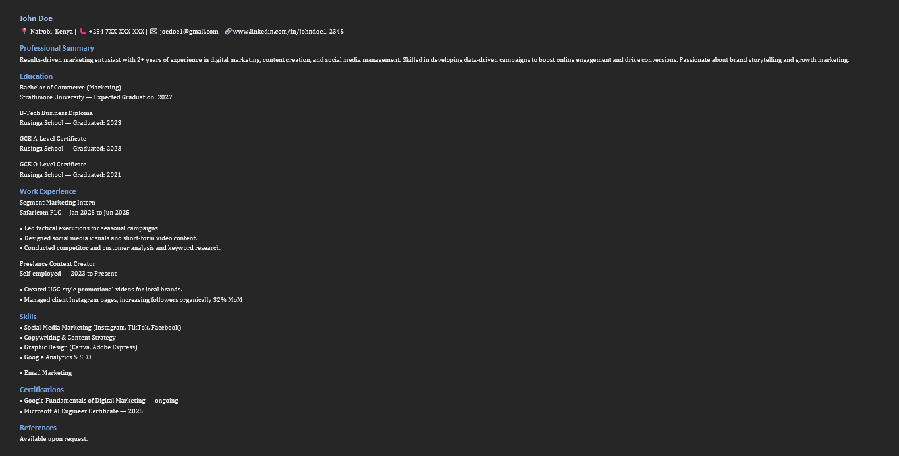
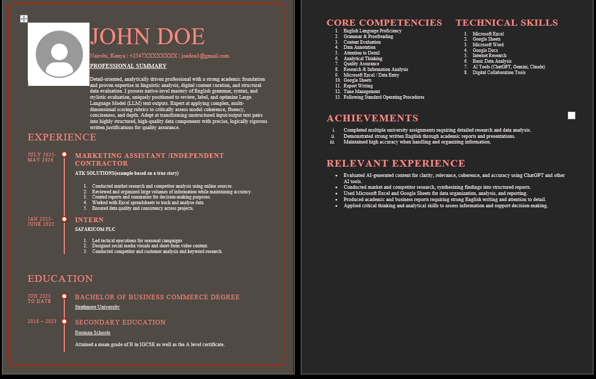

# ATK_SOLUTIONS

## Portfolio

## Frequently asked questions:

Q. Why should we trust you?

A. 'To be allowed through the door you need a written invitation'

Career branding is painting a worded picture of your personal and professional awards, skills and accolades with the purpose of inviting recruiters/employers to be apart of your progress and success 

To help students and young professionals transform their CVs into interview-ready documents. This is achieved through the following services:-
1. ATS-Friendly CV Makeovers
2. Professional Formatting
3. Cover Letters
4. LinkedIn Optimisation
5. Interview Readiness

This portfolio showcases a real example of CV improvements, ATS optimisation, and professional branding techniques. 

Q. Why and what changed?

A. The client was a third year Marketing student and his primary goal was landing an internship opportunity. The challenge was his original CV was:-
1. Generic bullet points
2. Poor formatting
3. No measurable achievements
4. Weak professional summary
5. Difficult to scan

The solution was a complete overhaul of his CV by:-
1.  Restructuring and rewriting bullet points
2.  Added achievement-driven language
3. Improved ATS compatibility
4. Reorganized sections
5. Added professional summary

End result was his CV moved from describing a responsibility to one that marks him aside as a man that is structured and capable of expressing himself both physically and in writting.

Currently, he has a full time remote job. 

# Helping a Marketing Student Stand Out for an Internship Application(s)

## Objective

Transforming a generic student CV into an interview-ready data analyst resume.

---

## Target Role

Remote AI Data Annotation

---

## Challenges

The original CV had:

- Generic responsibilities
- Limited measurable impact
- Weak professional summary
- Little ATS optimisation

---

## Strategy

I focused on:

- Rewriting bullet points
- Improving readability
- Better section hierarchy
- Stronger professional summary
- Marketing-specific keywords

---

# Original Submission

---

# Interview-Ready Version

---

## Key Improvements

| Before | After |
|---------|--------|
| Responsibilities | Achievements |
| Weak summary | Professional positioning |
| Basic formatting | ATS-friendly |
| Generic skills | Role-specific keywords |

---

## Skills Demonstrated

- Resume Strategy
- Career Branding
- ATS Optimisation
- Copywriting
- Professional Writing
